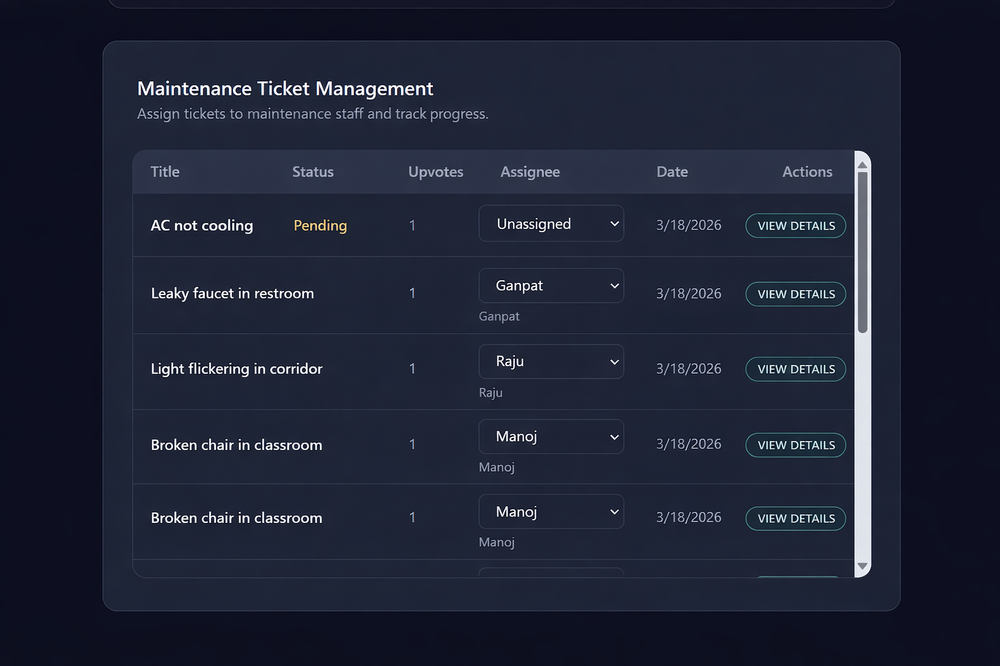
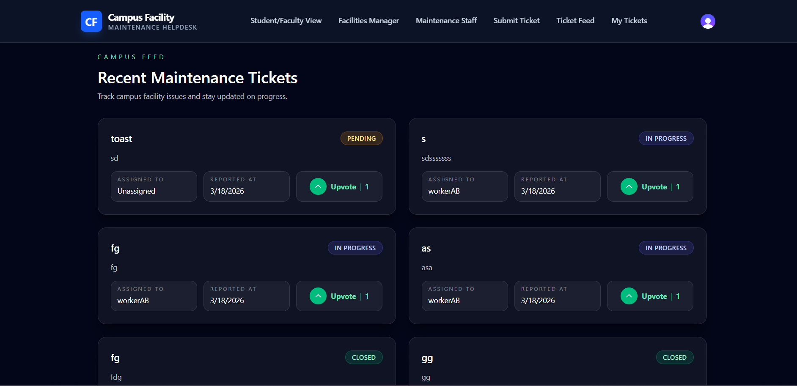
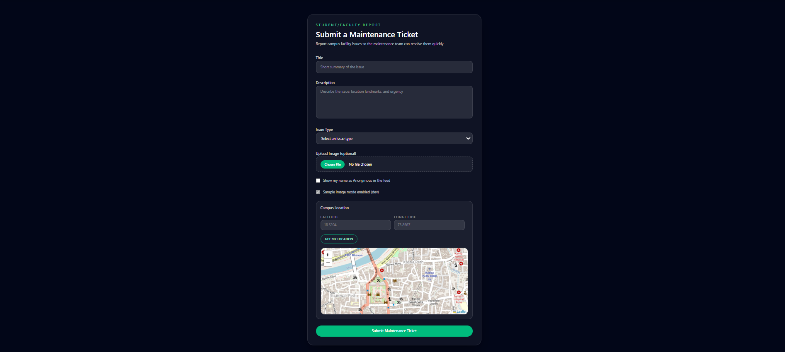

# CampusFix

CampusFix is a campus facility maintenance helpdesk that lets students and faculty report issues, enables facilities managers to triage and assign work, and helps maintenance staff resolve tickets with photo proof. The platform provides end-to-end visibility into every maintenance request lifecycle.

## Screenshots







## Highlights
- Role-based experiences for Students/Faculty, Facilities Managers, and Maintenance Staff
- Ticket submission with photos, geolocation, and anonymous reporting
- Ticket feed with upvoting and resolution confirmation
- Admin analytics dashboard with charts and campus heatmap
- Worker task dashboard with status progression and proof upload

## Tech Stack
**Frontend**
- React 19 + Vite 8
- React Router v7
- Redux Toolkit
- Clerk React SDK
- Tailwind CSS v4
- Recharts v3
- Leaflet + react-leaflet + leaflet.heat

**Backend**
- Node.js + Express 5
- MongoDB + Mongoose 9
- Clerk Node SDK
- Cloudinary + multer-storage-cloudinary
- morgan, cors

## Monorepo Structure
```
CampusFix/
  client/   # React frontend (Vite)
  server/   # Express API
```

## Core Roles
- **Student/Faculty**
  - Submit tickets with title, description, issue type, image, and location
  - Browse ticket feed, upvote, and confirm resolution
  - View "My Tickets"
- **Facilities Manager (Admin)**
  - View analytics, heatmap, and full ticket table
  - Assign/unassign workers
  - Create maintenance staff accounts
- **Maintenance Staff (Worker)**
  - View assigned tasks only
  - Progress status and upload proof for completion

## Ticket Lifecycle
```
Pending -> Assigned -> In Progress -> Completed -> Closed
```
Admin can unassign a worker, reverting the ticket to **Pending**. Reporters confirm completion to **Close** a ticket.

## API Overview
**Health**
- `GET /api/health`

**Tickets**
- `GET /api/tickets`
- `GET /api/tickets/all` (no-cache)
- `GET /api/tickets/:id`
- `POST /api/tickets/create` (multipart)
- `PUT /api/tickets/:id`
- `DEL /api/tickets/:id`
- `POST /api/tickets/:id/upvote`
- `PATCH /api/tickets/assign/:id`

**Issues / Tasks (Worker)**
- `GET /api/issues/tasks?userId=X`
- `PATCH /api/issues/:id/status`
- `POST /api/issues/:id/resolve` (multipart)
- `PATCH /api/issues/confirm/:issueId`

**Auth**
- `POST /api/auth/staff-login`

**Admin**
- `POST /api/admin/workers`

**Workers**
- `GET /api/workers`

## Environment Variables
Create `.env` files in `server/` and `client/`.

**server/.env**
```
PORT=7777
NODE_ENV=development
MONGO_URI=your_mongodb_connection_string
CLERK_SECRET_KEY=your_clerk_secret_key
CLOUDINARY_CLOUD_NAME=your_cloudinary_cloud_name
CLOUDINARY_API_KEY=your_cloudinary_api_key
CLOUDINARY_API_SECRET=your_cloudinary_api_secret
```

**client/.env**
```
VITE_CLERK_PUBLISHABLE_KEY=your_clerk_publishable_key
VITE_IMAGE_UPLOAD_MODE=real
```

`VITE_IMAGE_UPLOAD_MODE` can be set to `sample` for local testing without real uploads.

## Local Development
**1) Install dependencies**
```
cd server
npm install

cd ../client
npm install
```

**2) Run the backend**
```
cd server
npm run dev
```

**3) Run the frontend**
```
cd client
npm run dev
```

The frontend expects the API on `http://localhost:7777` by default.

## Authentication Notes
- Students/Faculty use Clerk (Google OAuth or email).
- Staff/Admin use a custom login endpoint that verifies credentials against Clerk.
- Role gating is enforced on routes:
  - Student: `/`, `/tickets/*`, `/my-tickets`
  - Admin: `/admin`
  - Worker: `/worker`

## Performance & Security Highlights
- Route-level code splitting with `React.lazy` and `Suspense`
- Client-side image compression to reduce upload times
- Role checks on protected endpoints
- CORS restricted to local dev origins

## Future Enhancements
- Push notifications (Twilio/Firebase)
- Google Maps integration
- AI-assisted issue classification
- Email notifications on status changes
- SLA tracking and reporting
- PWA support and multi-language UI

## License
ISC
